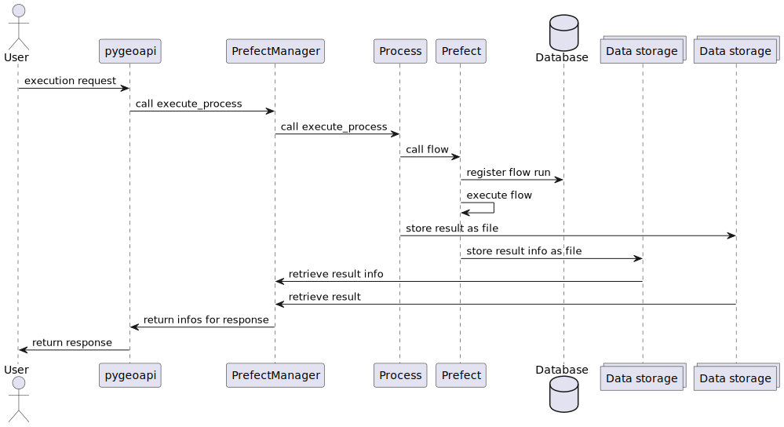

# pygeoapi-prefect

A process manager for [pygeoapi] that uses [prefect].

[pygeoapi]: https://pygeoapi.io/
[prefect]: https://www.prefect.io/

## Installation

1. Clone the repository: `git clone https://github.com/directedproject-eu/pygeoapi-prefect.git`
2. Install from source: `python3 -m pip install .`

## Configuration

Configure the job manager:
```yaml
server:
    manager:
        name: pygeoapi_prefect.manager.PrefectManager
        connection:
            result_storage: file:///home/<user>/.prefect/storage  # this is the default if the field isn't set
            result_serializer: json  # this is the default if the field isn't set
        output_dir: file:///home/<user>/.prefect/storage  # this is the default if the field isn't set
```
Note that `output_dir` is only used for outputs from plain pygeoapi processes and ignored for prefect processes. 
For prefect processes, output must be handled by the flow itself. `result_storage` and `output_dir` must include the URI scheme.

Configure your processes, e.g.:
```yaml
simple-prefect:
  type: process
  processor:
    name: pygeoapi_prefect.examples.simple_prefect.SimpleFlowProcessor
    prefect:
      outputs:
        basepath: /home/<user>/.prefect/storage
        type: LocalFileSystem
```

## Implementing a process

Check the example process in src/pygeoapi_prefect/examples/simple_prefect.py

## Execute a process

<figure>
  <p align="center">
  
  </p>
  <figcaption>Sequence diagram of a process execution request.</figcaption>
</figure>